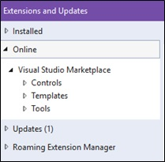
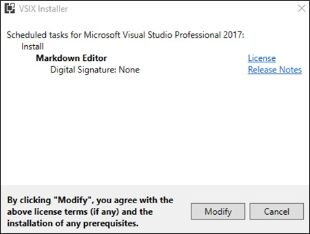

[//]: # (This markdown file will be opened and edited in Microsoft Visual Studio. Captivate will capture the screen as each step is followed, 
and the screen captures will be used to create a narrated instructional video.)

# How to edit markdown files in Microsoft Visual Studios
Many writing projects within the technical workplace often utilize plain text or markdown files. 
Rather than use a simple text editor with limited features, you can use [Visual Studios](https://www.visualstudio.com/) 
to easily create, edit and save markdown files both locally and with a source control repository such as GitHub.
Even though Visual Studios is geared toward developers, this tool can accelerate your projects by making your editing process more efficient. 
This user guide will help you maneuver this environment without feeling overwhelmed by the interface and many other capabilities of 
Visual Studios. 

### How to install Markdown Editor in Visual Studios: 

Before you can easily edit markdown files in Visual Studio, you must first install the [Markdown Editor](http://bit.ly/MarkdownEditor). 
This all-in-one editor allows you to see a preview of your file in a separate window as you work. 
It also offers numerous helpful features including image drag n’ drop, keyboard shortcuts and syntax highlighting. 
To install the Markdown Editor, complete the following steps: 

[//]: # (Make sure to resize images and then add them back in for final draft.)

1. Open Microsoft Visual Studio.

2. Click on **Tools** in the top menu.

   i. Click on **Extensions and Updates…**

    

   *The Extensions and Updates window will open on the screen*

3.	Click on **Online** in the left side menu.

    

4.	Type “markdown editor” into the search box

    

    *Results will automatically appear in the window*

5.	Click on **Download** next to Markdown Editor.

    *A progress window will appear and disappear once finished downloading*

6.	Click **Close**.

7.	Close out of Visual Studio.

    *Another progress window will appear briefly followed by the **VSIX Installer** window*

8.	Click on **Modify**.

    

    *Modifications will be installed into Visual Studio*

9.	Click on **Close**.

You have now installed the Markdown Editor in Visual Studio and are ready to open a markdown file for editing. 

### How to open a local markdown file:

If you already have a markdown file locally saved to your computer, it is quick and easy to open the file in Visual Studio for editing. 
To open a local markdown file, complete the following steps:

1.	Open Visual Studio. 

2.	Click on **File** in the top menu.

    i.	Hover over **Open** until a second menu appears.

3.	Click on **File…**

    
 
4.	Navigate to the markdown file location.

    
 
5.	Double click the **MD File** (markdown file).

You have now opened the markdown file, and it is ready to be edited using Markdown Editor.

### How to open a markdown file from source control:

If you don’t already have a markdown file saved to your computer, you can open a markdown file within Visual Studio from source control. 
Source control, also known as version control, helps manage and control changes to documents to avoid overwriting errors when a team of 
people is working on a project collaboratively. You can copy projects from your team’s online source control repository onto your computer 
to make changes without compromising the original file. To open a markdown file from source control, complete the following steps: 

1.	Open Visual Studio.

2.	Click **File** in the top menu.

    i.	Hover Open until a second menu appears.

3.	Click **Open from Source Control**.

    

     *The Team Explorer – Connect side panel appears on the right of the screen*

4.	Click on **Connect…** within the GitHub connection.

    
 
    *A sign in window for your GitHub account will appear on the screen*

5.	Sign into GitHub with your email and password.

    
 
    *Your GitHub project folders will appear in the Team Explorer – Connect side panel*

6.	Click **Clone** under the GitHub connection.

    
 
    *The **Clone a GitHub Repository** window will appear on the screen showing your project folders*

7.	Click on the project folder you want to clone to your local files.

8.	Click on **Browse** next to the destination path.

    *The **Browse for Folder** window will appear on the screen*

9.	Select a local destination for your project folder. 

    
 
10.	Click **OK**.

11.	Click **Clone**.

    
 
    *The **Solution Explorer – Folder View** side panel will appear on the right of the screen showing the 
folder you copied to your local files*
 
12.	Double click the **.md file** (markdown file).

You have now opened the markdown file, and it is ready to be edited.

### How to save a local markdown file:

Once you have opened the markdown file and edited it using the Markdown Editor, you can easily save your work to your local files. 
To save a local markdown file, complete the following steps:

1.	Click **File** in the top menu.

    i.	Click **Save As…**.

   *The **Save File As** window appears on the screen*

2.	Click the **Save as Type** dropdown menu 

    i.	Click Markdown file

    
 
3.	Click **Save**.

    *The Confirm Save As window appears on the screen*

4.	Click **Yes**.

The markdown file is now saved to your local files.

### How to save a markdown file to source control:

Once you have saved the markdown file to your local files and no more editing needs done, you can save, or upload, the edited markdown file 
back to the source control repository. This will replace the online file with the edited markdown file. To save a markdown file to source 
control, complete the following steps:

1.	Click on the **Team Explorer** tab in the bottom right of the screen.

    
 
    *The **Team Explorer – Connect** side panel appears on the screen*

2.	Double click the project folder where the markdown file is saved.

    
 
    *The markdown file will close and the **Team Explorer – Home** side panel will appear on the screen* 

3.	Click on **Changes** within the project dropdown box.

    
 
4.	Type a brief description of the changes you made into the highlighted text box.

    
  
5.	Click **Commit All**.

    *Changes have now been confirmed and are ready to sync*

6.	Click the blue back arrow in the **Team Explorer - Changes** top menu.

    
 
7.	Click **Sync** within the project dropdown box.

    
 
8.	Click **Push** within the Outgoing Commits dropdown box.

    
 
    *A loading bar appears within the **Team Explorer – Synchronization** side panel as changes are 
uploaded and will disappear once complete*
 
9.	Close Visual Studio.

The edited markdown file is now saved to the source control repository and has replaced the original online file. 

 
